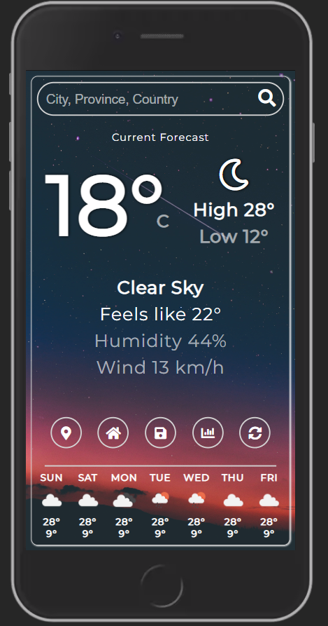

# Weather Application

First web development project using basic HTML, SCSS and JavaScript. Uses the Open Weather Map API to retrieve weather data and displays a mobile-first responsive design. Features accessibility considerations, the geolocation API, persistent storage, Fetch API with async/await and serverless functions.

The page is split into four sections.

1. Top search bar.
1. Main forecast display.
1. Navigation buttons.
1. 6-day forecast.
